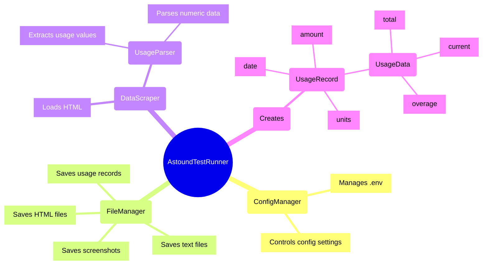

```mermaid
mindmap
  root((AstoundTestRunner))
    (ConfigManager)
      [Manages .env]
      [Controls config settings]
    (FileManager)
      [Saves screenshots]
      [Saves text files]
      [Saves HTML files]
      [Saves usage records]
    (DataScraper)
      [Loads HTML]
      (UsageParser)
        [Extracts usage values]
        [Parses numeric data]
    (Creates)
      (UsageRecord)
        [date]
        [amount]
        [units]
        (UsageData)
          [total]
          [current]
          [overage]
```
