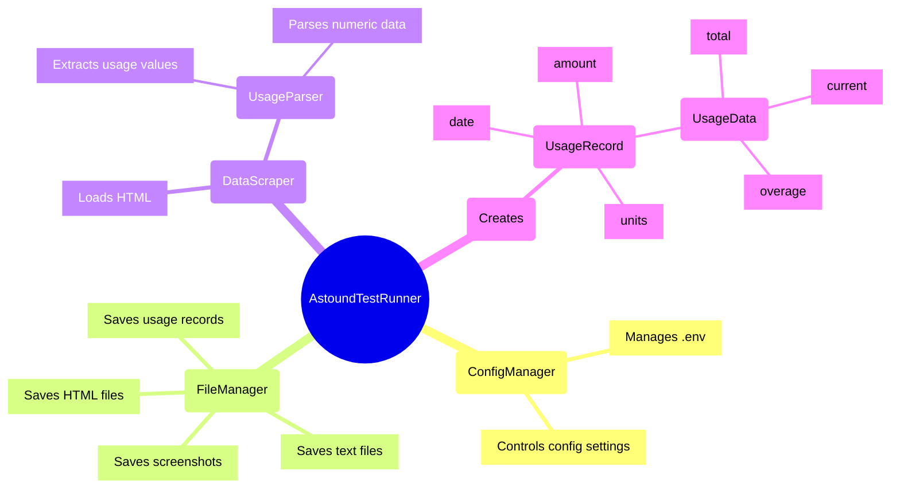
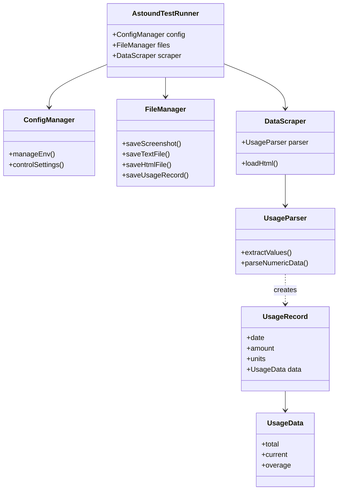

```mermaid
mindmap
  root((AstoundTestRunner))
    (ConfigManager)
      [Manages .env]
      [Controls config settings]
    (FileManager)
      [Saves screenshots]
      [Saves text files]
      [Saves HTML files]
      [Saves usage records]
    (DataScraper)
      [Loads HTML]
      (UsageParser)
        [Extracts usage values]
        [Parses numeric data]
    (Creates)
      (UsageRecord)
        [date]
        [amount]
        [units]
        (UsageData)
          [total]
          [current]
          [overage]
```

```mermaid
classDiagram
    class AstoundTestRunner {
        +ConfigManager config
        +FileManager files
        +DataScraper scraper
    }

    class ConfigManager {
        +manageEnv()
        +controlSettings()
    }

    class FileManager {
        +saveScreenshot()
        +saveTextFile()
        +saveHtmlFile()
        +saveUsageRecord()
    }

    class DataScraper {
        +UsageParser parser
        +loadHtml()
    }

    class UsageParser {
        +extractValues()
        +parseNumericData()
    }

    class UsageRecord {
        +date
        +amount
        +units
        +UsageData data
    }

    class UsageData {
        +total
        +current
        +overage
    }

    AstoundTestRunner --> ConfigManager
    AstoundTestRunner --> FileManager
    AstoundTestRunner --> DataScraper
    DataScraper --> UsageParser
    UsageParser ..> UsageRecord : creates
    UsageRecord --> UsageData
```
