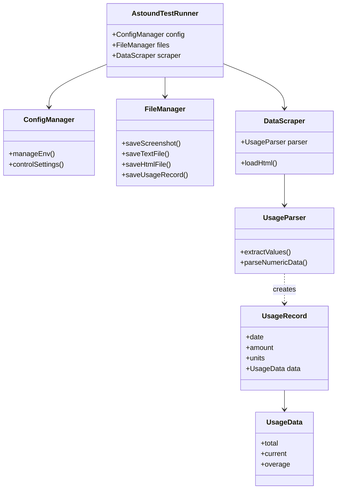

```mermaid
classDiagram
    class AstoundTestRunner {
        +ConfigManager config
        +FileManager files
        +DataScraper scraper
    }

    class ConfigManager {
        +manageEnv()
        +controlSettings()
    }

    class FileManager {
        +saveScreenshot()
        +saveTextFile()
        +saveHtmlFile()
        +saveUsageRecord()
    }

    class DataScraper {
        +UsageParser parser
        +loadHtml()
    }

    class UsageParser {
        +extractValues()
        +parseNumericData()
    }

    class UsageRecord {
        +date
        +amount
        +units
        +UsageData data
    }

    class UsageData {
        +total
        +current
        +overage
    }

    AstoundTestRunner --> ConfigManager
    AstoundTestRunner --> FileManager
    AstoundTestRunner --> DataScraper
    DataScraper --> UsageParser
    UsageParser ..> UsageRecord : creates
    UsageRecord --> UsageData
```
